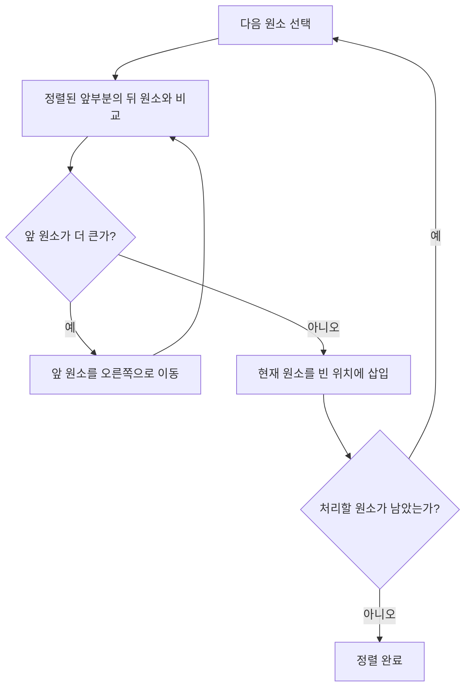
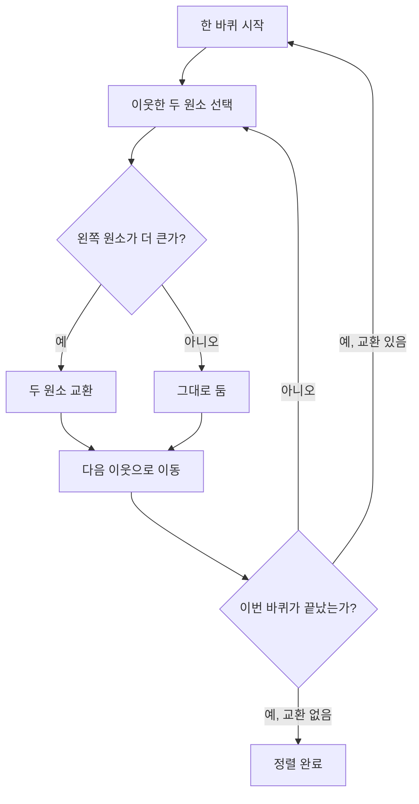
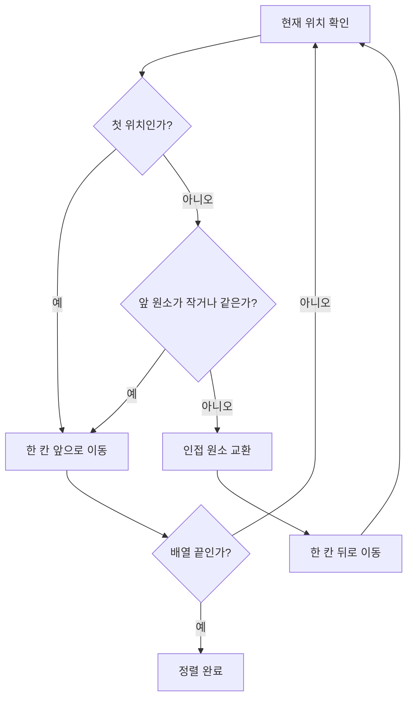
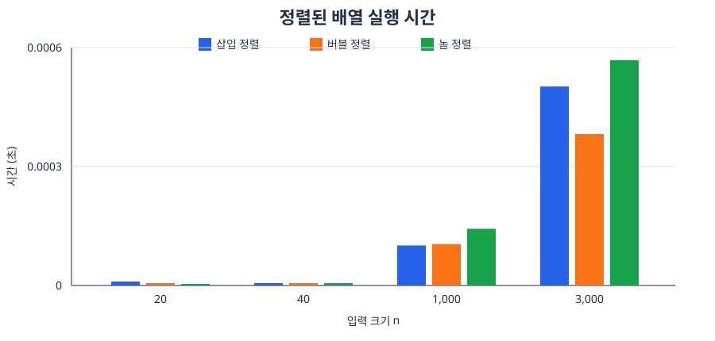
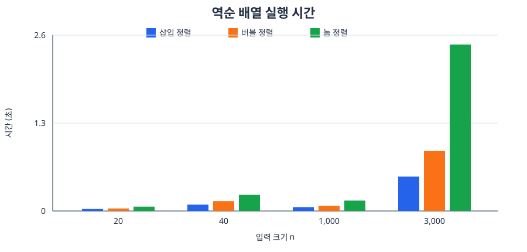
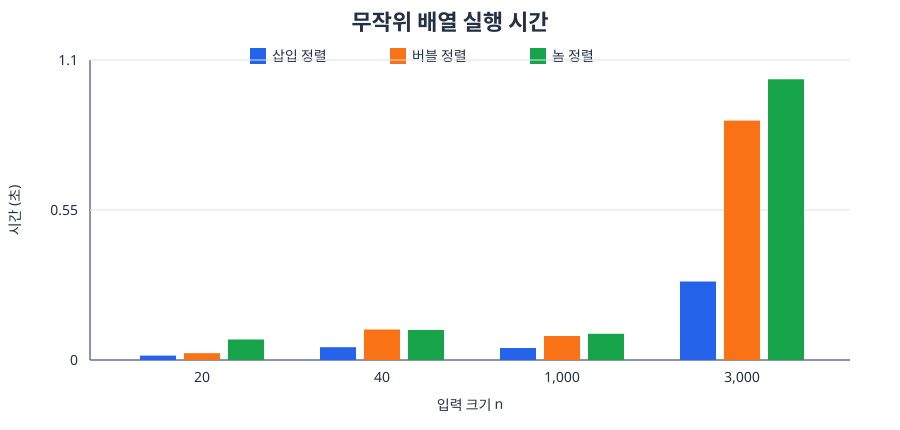

# 삽입 기반 정렬 알고리즘 비교

이 보고서는 삽입 정렬, 버블 정렬, 놈 정렬을 비교한다. 세 알고리즘은 모두
리스트 하나를 받아 오름차순으로 제자리 정렬하는 같은 함수 형식을 사용한다.

## 비교 기준

기존 `src/practice/knuthshell_insertion_comparison.py`의 비교 방식을 참고해
다음 기준으로 측정한다.

- 모든 알고리즘에 같은 정렬·역순·무작위 입력을 전달한다.
- 정렬 함수마다 입력 리스트의 복사본을 사용한다.
- `random.seed(2026)`으로 입력을 고정한다.
- 정렬 결과가 `sorted`의 결과와 같은지 확인한다.
- `time.perf_counter()`로 실행 시간을 측정한다.

## 비교 프로그램

```python
import random
import time

from bubble_stop import bubble_sort
from gnome_sort import gnome_sort
from insertion_sort import insertion_sort


def measure(sort, values):
    start = time.perf_counter()
    sort(values)
    return time.perf_counter() - start


def compare_case(name, original, algorithms):
    print(f"\\n[{name}]")
    print(f"{'n':>7} {'삽입 정렬(s)':>15} "
          f"{'버블 정렬(s)':>15} {'놈 정렬(s)':>15}")
    for size, values in original:
        times = []
        for algorithm_name, sort in algorithms:
            candidate = list(values)
            elapsed = measure(sort, candidate)
            assert candidate == sorted(values), algorithm_name
            times.append(elapsed)
        print(f"{size:>7} {times[0]:>15.6f} "
              f"{times[1]:>15.6f} {times[2]:>15.6f}")


if __name__ == "__main__":
    random.seed(2026)

    algorithms = (
        ("삽입 정렬", insertion_sort),
        ("버블 정렬", bubble_sort),
        ("놈 정렬", gnome_sort),
    )

    sizes = (20, 40, 1000, 3000)
    random_inputs = [
        (size, [random.randrange(size * 10) for _ in range(size)])
        for size in sizes
    ]
    sorted_inputs = [(size, sorted(values)) for size, values in random_inputs]
    reversed_inputs = [(size, list(reversed(values)))
                       for size, values in sorted_inputs]

    compare_case("정렬된 배열", sorted_inputs, algorithms)
    compare_case("역순 배열", reversed_inputs, algorithms)
    compare_case("무작위 배열", random_inputs, algorithms)
```

위 코드는 `src/practice`에서 실행한다.

```sh
cd src/practice
python3 comparison.py
```

## 알고리즘 설명

### 삽입 정렬

정렬된 앞부분을 유지하면서 다음 원소를 알맞은 위치에 삽입한다. 이미
정렬된 입력에서는 한 번씩만 확인하면 되므로 빠르지만, 역순 입력에서는
많은 원소를 뒤로 이동해야 한다.

핵심은 카드가 이미 정렬된 카드 묶음에 한 장씩 들어가는 과정과 같다. 현재
원소보다 큰 원소를 오른쪽으로 한 칸씩 밀고, 비어 있는 자리에 현재 원소를
넣는다.



### 버블 정렬

서로 이웃한 원소를 비교해 큰 원소를 오른쪽으로 이동시킨다. 현재 구현은
한 번의 순회에서 교환이 없으면 조기 종료하므로 이미 정렬된 입력에
대해서는 빠르게 끝난다.

한 바퀴가 끝날 때마다 가장 큰 원소 하나가 배열의 오른쪽 끝에 고정된다.
따라서 다음 바퀴에서는 이미 고정된 오른쪽 부분을 다시 확인하지 않는다.



### 놈 정렬

현재 원소와 바로 앞 원소를 비교한다. 순서가 맞으면 앞으로 진행하고,
순서가 틀리면 두 원소를 교환한 뒤 한 칸 뒤로 돌아간다. 삽입 정렬과
비슷한 결과를 내지만, 원소를 한 칸씩 교환한다는 차이가 있다.

정원사가 줄을 따라 걸으며 화분의 순서를 확인하는 모습으로 생각할 수
있다. 순서가 맞으면 한 칸 앞으로 가고, 순서가 틀리면 두 화분을 바꾼 뒤
뒤로 돌아가 다시 확인한다.



## 시간 복잡도

| 알고리즘 | 최선 | 평균 | 최악 | 추가 공간 | 안정성 |
|---|---:|---:|---:|---:|---|
| 삽입 정렬 | $O(n)$ | $O(n^2)$ | $O(n^2)$ | $O(1)$ | 안정 |
| 버블 정렬 | $O(n)$* | $O(n^2)$ | $O(n^2)$ | $O(1)$ | 안정 |
| 놈 정렬 | $O(n)$ | $O(n^2)$ | $O(n^2)$ | $O(1)$ | 안정 |

`*` 버블 정렬은 교환이 없을 때 조기 종료하는 현재 구현을 기준으로 한다.

세 알고리즘은 모두 같은 점근적 시간 복잡도를 가지지만, 실제 수행 과정은
다르다. 삽입 정렬은 원소를 한 번에 적절한 위치로 이동한다. 버블 정렬은
인접 원소를 여러 번 교환하고, 놈 정렬은 교환 후 이전 위치로 돌아간다.

## 측정 결과

다음 결과는 이 작업 환경에서 고정된 입력을 사용해 측정했다. 모든 결과는
Python의 `sorted`와 비교해 정렬 여부를 확인했다. 실행 시간은 컴퓨터와
실행 환경에 따라 달라질 수 있다.

### 정렬된 배열

| n | 삽입 정렬 (초) | 버블 정렬 (초) | 놈 정렬 (초) |
|---:|---:|---:|---:|
| 20 | 0.000010 | 0.000005 | 0.000004 |
| 40 | 0.000006 | 0.000005 | 0.000006 |
| 1,000 | 0.000101 | 0.000104 | 0.000143 |
| 3,000 | 0.000502 | 0.000382 | 0.000568 |

### 역순 배열

| n | 삽입 정렬 (초) | 버블 정렬 (초) | 놈 정렬 (초) |
|---:|---:|---:|---:|
| 20 | 0.000029 | 0.000037 | 0.000063 |
| 40 | 0.000094 | 0.000145 | 0.000238 |
| 1,000 | 0.057040 | 0.077298 | 0.153545 |
| 3,000 | 0.508168 | 0.885391 | 2.451873 |

### 무작위 배열

| n | 삽입 정렬 (초) | 버블 정렬 (초) | 놈 정렬 (초) |
|---:|---:|---:|---:|
| 20 | 0.000016 | 0.000025 | 0.000075 |
| 40 | 0.000047 | 0.000112 | 0.000110 |
| 1,000 | 0.043900 | 0.087986 | 0.095969 |
| 3,000 | 0.287888 | 0.877853 | 1.027525 |

정렬된 배열에서는 세 알고리즘 모두 빠르게 끝났다. 역순 배열에서는
삽입 정렬보다 버블 정렬이 느렸고, 놈 정렬은 교환 후 계속 뒤로 돌아가야
하므로 가장 느렸다. 무작위 배열에서도 삽입 정렬이 가장 빠르게 측정되었고,
버블 정렬과 놈 정렬은 인접 교환이 많아 더 오래 걸렸다.

### 실행 시간 그래프

아래 그래프는 입력 배열 유형별로 하나씩 구성했다. 색상은 다음과 같다.

| 색상 | 알고리즘 |
|---|---|
| 파란색 | 삽입 정렬 |
| 주황색 | 버블 정렬 |
| 초록색 | 놈 정렬 |

입력 유형마다 실행 시간의 범위가 달라 그래프의 세로축 범위도 각각 다르다.
각 그래프 아래에는 막대와 대응하는 정확한 측정값도 함께 표시했다.

#### 정렬된 배열



정확한 수치는 다음 표와 같다.

| n | 삽입 정렬 | 버블 정렬 | 놈 정렬 |
|---:|---:|---:|---:|
| 20 | 0.000010 | 0.000005 | 0.000004 |
| 40 | 0.000006 | 0.000005 | 0.000006 |
| 1,000 | 0.000101 | 0.000104 | 0.000143 |
| 3,000 | 0.000502 | 0.000382 | 0.000568 |

#### 역순 배열



정확한 수치는 다음 표와 같다.

| n | 삽입 정렬 | 버블 정렬 | 놈 정렬 |
|---:|---:|---:|---:|
| 20 | 0.000029 | 0.000037 | 0.000063 |
| 40 | 0.000094 | 0.000145 | 0.000238 |
| 1,000 | 0.057040 | 0.077298 | 0.153545 |
| 3,000 | 0.508168 | 0.885391 | 2.451873 |

#### 무작위 배열



정확한 수치는 다음 표와 같다.

| n | 삽입 정렬 | 버블 정렬 | 놈 정렬 |
|---:|---:|---:|---:|
| 20 | 0.000016 | 0.000025 | 0.000075 |
| 40 | 0.000047 | 0.000112 | 0.000110 |
| 1,000 | 0.043900 | 0.087986 | 0.095969 |
| 3,000 | 0.287888 | 0.877853 | 1.027525 |

다만 거의 정렬된 입력에서는 버블 정렬의 조기 종료와 삽입 정렬의 적은
이동 덕분에 결과가 달라질 수 있다. 따라서 하나의 무작위 입력 결과만으로
알고리즘의 모든 성능을 판단하지 않고, 정렬된 배열·역순 배열·거의 정렬된
배열도 추가로 비교하는 것이 바람직하다.
