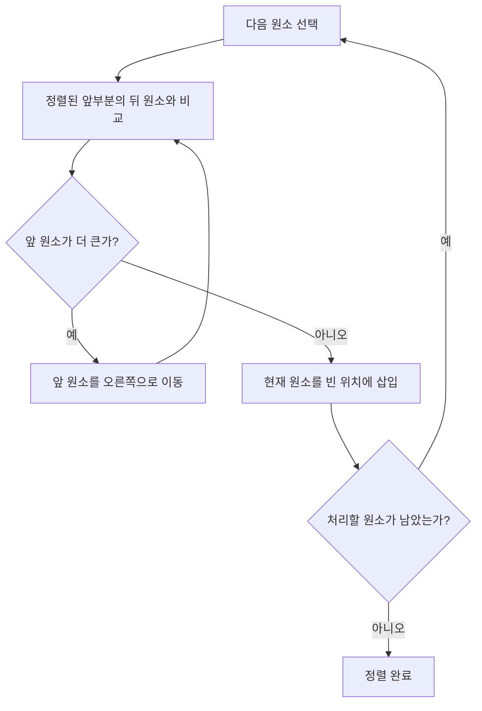
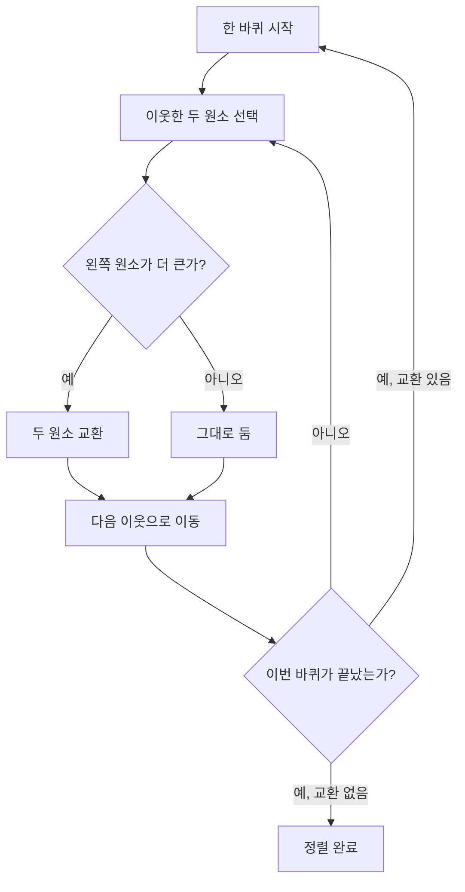
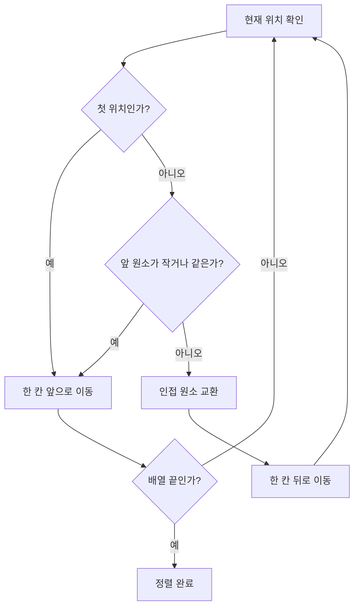
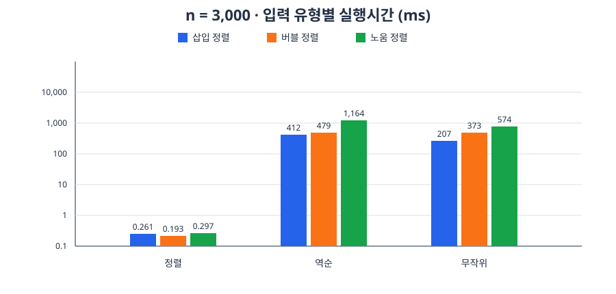
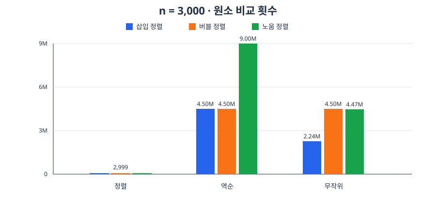
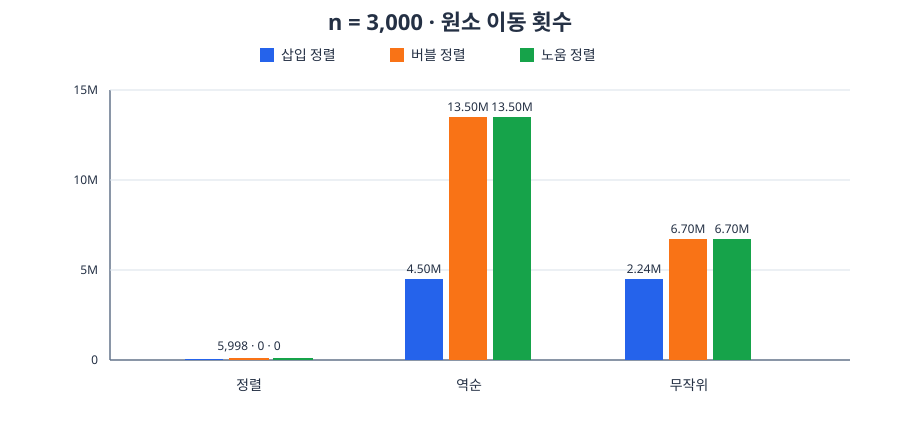
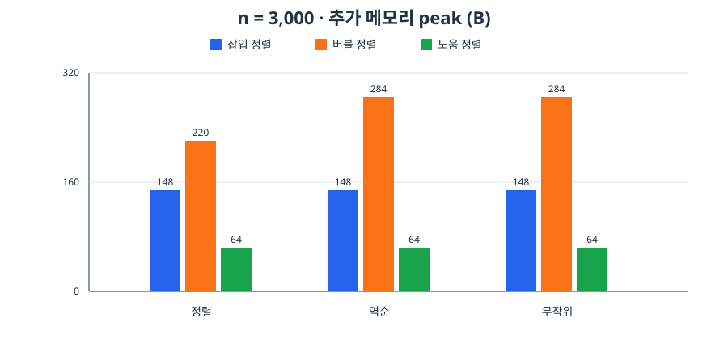

# 고급알고리즘 정렬 비교 보고서 - Insertion · Bubble · Gnome

이 보고서는 [삽입 정렬](../src/practice/insertion_sort.py), [버블 정렬](../src/practice/bubble_stop.py), [노움(난쟁이) 정렬](../src/practice/gnome_sort.py)을 구현하고 비교한다. 세 알고리즘은 모두
배열 하나를 받아 오름차순으로 제자리 정렬한다. 기본 호출은 계측하지 않고,
선택적으로 통계 객체를 전달하면 비교 횟수와 이동 횟수를 기록한다.

## 차례

1. [알고리즘 설명](#알고리즘-설명)
2. [비교 기준 및 코드 보고서](#비교-기준-및-코드-보고서)
3. [결과](#결과)


## 알고리즘 설명

### 삽입 정렬

Key를 꺼내 따로 보관하고, 그 앞의 정렬된 원소들을 뒤에서부터 key와 비교한다. Key보다 큰 원소는 오른쪽으로 밀고, 작거나 같은 원소를 찾으면 그 원소 바로 뒤에 key를 삽입한다.

이미 정렬된 입력에서는 한 번씩만 확인하면 되므로 빠르지만, 역순 입력에서는 많은 원소를 뒤로 이동해야 한다.


```mermaid
flowchart TD
    A[다음 원소 선택] --> B[정렬된 앞부분의 뒤 원소와 비교]
    B --> C{앞 원소가 더 큰가?}
    C -->|예| D[앞 원소를 오른쪽으로 이동]
    D --> B
    C -->|아니오| E[현재 원소를 빈 위치에 삽입]
    E --> F{처리할 원소가 남았는가?}
    F -->|예| A
    F -->|아니오| G[정렬 완료]
```

### 버블 정렬

서로 이웃한 원소를 비교해 큰 원소를 오른쪽으로 이동시킨다. 한 회전이 끝날 때마다 가장 큰 원소 하나가 배열의 오른쪽 끝에 고정되기에 다음 회전부터는 이미 고정된 오른쪽 부분을 다시 확인하지 않는다. 여기서의 구현은 한 번의 회전에서 교환이 없으면 조기 종료하는 flag가 추가됐다. 그러므로 이미 정렬된 배열에 대해서는 빠르게 끝난다.


```mermaid
flowchart TD
    A[한 바퀴 시작] --> B[이웃한 두 원소 선택]
    B --> C{왼쪽 원소가 더 큰가?}
    C -->|예| D[두 원소 교환]
    C -->|아니오| E[그대로 둠]
    D --> F[다음 이웃으로 이동]
    E --> F
    F --> G{이번 바퀴가 끝났는가?}
    G -->|아니오| B
    G -->|예, 교환 있음| A
    G -->|예, 교환 없음| H[정렬 완료]
```

### 노움 정렬

현재 원소와 바로 앞 원소를 비교한다. 순서가 맞으면 앞으로 진행하고, 순서가 다르면 두 원소를 교환한 뒤 한 칸 뒤로 돌아가서 다시 확인한다. 삽입 정렬과 비슷한 것 같지만, 원소를 한 칸씩 교환해야 한다는 차이가 있다.


```mermaid
flowchart TD
    A[현재 위치 확인] --> B{첫 위치인가?}
    B -->|예| C[한 칸 앞으로 이동]
    B -->|아니오| D{앞 원소가 작거나 같은가?}
    D -->|예| C
    D -->|아니오| E[인접 원소 교환]
    E --> F[한 칸 뒤로 이동]
    F --> A
    C --> G{배열 끝인가?}
    G -->|아니오| A
    G -->|예| H[정렬 완료]
```


### 왜 노움 정렬인가

노움 정렬은 가장 빠른 알고리즘이라서 선택한 것은 아니다. 삽입 정렬과 버블 정렬 사이에 놓인 동작 방식을 비교하기 위해 선택했다. 삽입 정렬은 큰 원소들을 밀어 빈자리를 만든 뒤 원소를 삽입하고, 버블 정렬은 한 방향으로 끝까지 훑으며 이웃한 원소를 교환한다. 노움 정렬은 이웃한 원소를 교환하면서 필요할 때 이전 위치로 되돌아간다. 따라서 세 알고리즘의 움직임을 비교하면 이동 원리가 연산량과 성능에 어떤 차이를 만드는지 살펴보고자 했다.

### 세 정렬을 나란히

| 알고리즘 | 최선 | 평균 | 최악 | 공간 | 안정성 |
|---|---:|---:|---:|---:|---|
| 삽입 정렬 | $O(n)$ | $O(n^2)$ | $O(n^2)$ | $O(1)$ | 안정 |
| 버블 정렬 | $O(n)$* | $O(n^2)$ | $O(n^2)$ | $O(1)$ | 안정 |
| 노움 정렬 | $O(n)$ | $O(n^2)$ | $O(n^2)$ | $O(1)$ | 안정 |

`*` 버블 정렬은 교환이 없을 때 조기 종료하는 현재 구현을 기준으로 한다.

세 알고리즘은 모두 같은 점근적 시간 복잡도를 가지지만, 실제 수행 과정은 다르다. 삽입 정렬은 원소를 한 번에 적절한 위치로 이동한다. 버블 정렬은 인접 원소를 여러 번 교환하고, 노움 정렬은 교환 후 이전 위치로 돌아간다.


## 비교 기준 및 코드 보고서

강의 algorithm-code 저장소에 `src/topic-02-basic-sorting/03_shell_sort/performance_comparison.py`의 비교 방식을 참고해
다음 기준으로 측정한다.

### 1. 배열
모든 알고리즘에 같은 정렬·역순·무작위 배열을 전달한다. 다만 거의 정렬된 입력에서는 버블 정렬의 조기 종료와 삽입 정렬의 적은 이동 덕분에 결과가 달라질 수 있다는 점을 기억해야 한다. 따라서 하나의 무작위 입력 결과만으로 알고리즘의 모든 성능을 판단하기에는 한계가 있지만, 비교를 위해 무작위 입력을 `random.seed(2026)`으로 고정했다.

정렬 알고리즘마다 배열 리스트의 복사본을 사용한다. 원본 배열은 따로 둔다.

### 2. 실행시간
`measure()`로 계측(비교,이동) 카운터 없이 정렬을 다섯 번 재고, 중앙값을 밀리초(ms)로 표시한다.

### 3. 비교와 이동 횟수
비교 횟수는 정렬 순서를 판단하기 위해 원소의 값을 서로 비교한 횟수다. 삽입 정렬에서는 배열 원소 `a[j]`와 임시 변수 `key`의 값을 비교하는 경우도 포함한다. 버블·노움 정렬은 이웃한 배열 원소의 값을 비교한다. 인덱스나 반복
범위를 확인하는 비교는 세지 않는다.

이동 횟수는 배열을 정렬하기 위해 원소 위치를 옮긴 횟수다. 삽입 정렬에서는 원소를 `key` 임시 변수에 보관, 배열 원소를 한 칸 이동, `key`를 배열에 기록하는 작업을 각각 1회로 센다. 버블·노움 정렬은 원소 교환은 임시 보관을 포함해 3회 이동으로 센다. 이미 정렬된 원소를 비교만 하고 쓰지 않으면 이동은 0회다.

이 기준은 알고리즘 내부의 자료 이동량을 세기 위한 것이다. 실제 CPU 명령 수나 메모리 버스 전송량과 같지는 않다.

참고로 비교·이동 횟수는 시간 측정과는 다른 별도의 계측 실행으로 센다.

### 4. 추가 메모리
추가 메모리는 배열을 만든 뒤 `tracemalloc`을 시작하고, 정렬 함수가 실행되는 동안 기준 시점보다 늘어난 Python 메모리의 peak를 바이트로 측정했다. 배열 자체의 메모리는 제외했다.

세 구현 모두 정렬용 보조 배열을 만들지 않으므로 이론적인 추가 공간은 $O(1)$이다. 측정되는 바이트 값은 Python 구현과 측정 도구의 일시적인 객체 할당까지 포함한 한 번의 peak 측정이므로, 다른 Python 버전이나 실행 환경에서 달라질 수 있다. 점근적 공간 복잡도를 대신하는 값은 아니다.

### 5. 정확성 및 안정성
정렬이 끝날 때마다 결과가 Python의 `sorted()` 결과와 같은지 확인해서 정확성을 테스트한다.

안정성은 정렬 기준 값이 같은 항목들의 원래 순서를 보존하는지를 나타낸다. 이 테스트는 세 배열 유형별 성능 측정과 별도로 한 번 수행한다. 숫자만 정렬하면 같은 값들의 순서가 바뀌어도 알아차리기 어렵기 때문에 비교할 때는 `key`와 원래 순서를 나타내는 `label`을 가진 항목을 사용한다. 항목 비교는 `key`만으로 하고, 정렬 뒤 같은 `key` 그룹 안의 `label` 순서가 입력 때와 같은지 확인한다. 테스트 입력은 `(2, a), (1, b), (2, c), (1, d), (2, e)`이고, 안정 정렬이라면 결과는 `(1, b), (1, d), (2, a), (2, c), (2, e)`다. 세 알고리즘 모두 동등한 키끼리는 교환하지 않아 이 검사를 통과했다.


### 비교 프로그램

```python
import random
import statistics
import tracemalloc
import time

from bubble_stop import bubble_sort
from gnome_sort import gnome_sort
from insertion_sort import insertion_sort


def measure(sort, values):
    elapsed_samples = []
    for _ in range(5):
        candidate = list(values)
        start = time.perf_counter()
        sort(candidate)
        elapsed_samples.append(time.perf_counter() - start)
        assert candidate == sorted(values)
    return statistics.median(elapsed_samples) * 1000


def count_operations(sort, original):
    values = list(original)
    stats = [0, 0]
    sort(values, stats)
    assert values == sorted(original)
    return stats


def measure_peak_memory(sort, original):
    values = list(original)
    tracemalloc.start()
    baseline, _ = tracemalloc.get_traced_memory()
    try:
        sort(values)
        _, peak = tracemalloc.get_traced_memory()
        return max(0, peak - baseline)
    finally:
        tracemalloc.stop()


def compare_case(name, original, algorithms):
    print(f"\\n[{name}]")
    print(f"{'n':>7} {'알고리즘':>12} {'시간(ms)':>10} {'비교':>12} "
          f"{'이동':>12} {'추가 메모리(B)':>16}")
    for size, values in original:
        for algorithm_name, sort in algorithms:
            elapsed = measure(sort, values)
            comparisons, moves = count_operations(sort, values)
            peak_memory = measure_peak_memory(sort, values)
            print(f"{size:>7} {algorithm_name:>12} {elapsed:>10.6f} "
                  f"{comparisons:>12} {moves:>12} {peak_memory:>16}")


class StabilityItem:
    def __init__(self, key, label):
        self.key = key
        self.label = label

    def __gt__(self, other):
        return self.key > other.key

    def __le__(self, other):
        return self.key <= other.key


def check_stability(sort):
    values = [StabilityItem(2, "a"), StabilityItem(1, "b"),
              StabilityItem(2, "c"), StabilityItem(1, "d"),
              StabilityItem(2, "e")]
    sort(values)
    return [(item.key, item.label) for item in values] == [
        (1, "b"), (1, "d"), (2, "a"), (2, "c"), (2, "e")
    ]


if __name__ == "__main__":
    random.seed(2026)

    algorithms = (
        ("삽입 정렬", insertion_sort),
        ("버블 정렬", bubble_sort),
        ("노움 정렬", gnome_sort),
    )

    sizes = (20, 40, 1000, 3000)
    random_inputs = [
        (size, [random.randrange(size * 10) for _ in range(size)])
        for size in sizes
    ]
    sorted_inputs = [(size, sorted(values)) for size, values in random_inputs]
    reversed_inputs = [(size, list(reversed(values)))
                       for size, values in sorted_inputs]

    compare_case("정렬된 배열", sorted_inputs, algorithms)
    compare_case("역순 배열", reversed_inputs, algorithms)
    compare_case("무작위 배열", random_inputs, algorithms)

    print("\\n[안정성]")
    for name, sort in algorithms:
        print(f"{name}: {'안정' if check_stability(sort) else '불안정'}")
```

위 코드는 `src/practice`에서 실행한다.

## 결과

### 정렬된 배열

| n | 알고리즘 | 시간 (ms) | 비교 횟수 | 이동 횟수 | 추가 메모리 (B) |
|---:|---|---:|---:|---:|---:|
| 20 | 삽입 정렬 | 0.002316 | 19 | 38 | 88 |
| 20 | 버블 정렬 | 0.002309 | 19 | 0 | 128 |
| 20 | 노움 정렬 | 0.002855 | 19 | 0 | 0 |
| 40 | 삽입 정렬 | 0.004232 | 39 | 78 | 88 |
| 40 | 버블 정렬 | 0.001988 | 39 | 0 | 128 |
| 40 | 노움 정렬 | 0.004174 | 39 | 0 | 0 |
| 1,000 | 삽입 정렬 | 0.092308 | 999 | 1,998 | 148 |
| 1,000 | 버블 정렬 | 0.042243 | 999 | 0 | 220 |
| 1,000 | 노움 정렬 | 0.088527 | 999 | 0 | 64 |
| 3,000 | 삽입 정렬 | 0.261181 | 2,999 | 5,998 | 148 |
| 3,000 | 버블 정렬 | 0.192690 | 2,999 | 0 | 220 |
| 3,000 | 노움 정렬 | 0.297244 | 2,999 | 0 | 64 |

### 역순 배열

| n | 알고리즘 | 시간 (ms) | 비교 횟수 | 이동 횟수 | 추가 메모리 (B) |
|---:|---|---:|---:|---:|---:|
| 20 | 삽입 정렬 | 0.014992 | 190 | 228 | 88 |
| 20 | 버블 정렬 | 0.014941 | 190 | 570 | 128 |
| 20 | 노움 정렬 | 0.037498 | 380 | 570 | 0 |
| 40 | 삽입 정렬 | 0.059742 | 780 | 857 | 88 |
| 40 | 버블 정렬 | 0.061285 | 780 | 2,337 | 128 |
| 40 | 노움 정렬 | 0.158001 | 1,559 | 2,337 | 0 |
| 1,000 | 삽입 정렬 | 41.891047 | 499,500 | 501,451 | 148 |
| 1,000 | 버블 정렬 | 47.924892 | 499,500 | 1,498,359 | 284 |
| 1,000 | 노움 정렬 | 141.153967 | 998,953 | 1,498,359 | 64 |
| 3,000 | 삽입 정렬 | 412.113470 | 4,498,494 | 4,504,349 | 148 |
| 3,000 | 버블 정렬 | 478.768562 | 4,498,500 | 13,495,053 | 284 |
| 3,000 | 노움 정렬 | 1,164.066094 | 8,996,845 | 13,495,053 | 64 |

### 무작위 배열

| n | 알고리즘 | 시간 (ms) | 비교 횟수 | 이동 횟수 | 추가 메모리 (B) |
|---:|---|---:|---:|---:|---:|
| 20 | 삽입 정렬 | 0.006045 | 69 | 89 | 88 |
| 20 | 버블 정렬 | 0.009631 | 162 | 153 | 128 |
| 20 | 노움 정렬 | 0.011926 | 120 | 153 | 0 |
| 40 | 삽입 정렬 | 0.027646 | 345 | 386 | 88 |
| 40 | 버블 정렬 | 0.048247 | 777 | 924 | 128 |
| 40 | 노움 정렬 | 0.229532 | 653 | 924 | 0 |
| 1,000 | 삽입 정렬 | 25.492448 | 257,979 | 258,983 | 148 |
| 1,000 | 버블 정렬 | 42.009697 | 499,347 | 770,955 | 284 |
| 1,000 | 노움 정렬 | 64.145360 | 514,964 | 770,955 | 64 |
| 3,000 | 삽입 정렬 | 207.498668 | 2,236,867 | 2,239,875 | 148 |
| 3,000 | 버블 정렬 | 373.318773 | 4,495,497 | 6,701,631 | 284 |
| 3,000 | 노움 정렬 | 574.498950 | 4,470,744 | 6,701,631 | 64 |

### 결과 요약

`n = 3,000` 무작위 입력에서는 삽입 정렬이 가장 적은 비교와 이동으로 가장 짧은 실행 시간을 보였다. 역순 입력에서는 노움 정렬이 가장 느렸다. 아래 그래프는 각 지표를 따로 보여준다.

### 실행시간



세 알고리즘은 정렬된 입력에서 모두 빠르게 끝났고, 역순과 무작위 입력에서는 시간이 크게 늘었다. 특히 역순 입력에서 노움 정렬은 약 1.16초로 가장 오래 걸렸다. 시간 축은 짧은 구간과 긴 구간을 함께 볼 수 있도록 로그 눈금을 사용했다.

### 비교·이동



비교 횟수는 정렬 순서를 판단하려고 원소 값을 서로 비교한 횟수다. 정렬된 입력에서는 모두 `n - 1`회였고, 역순 입력에서는 노움 정렬이 약 900만 회로 가장 많았다.



이동 횟수는 이 보고서의 계수 기준에 따른 배열 원소의 대입 및 교환 작업 수다. 역순 입력에서 삽입 정렬은 원소를 밀어 한 번에 자리를 만들기 때문에 버블·노움 정렬보다 이동 수가 적었다. 그래프의 0회 값은 막대 대신 기준선으로 표시했다.

### 메모리



추가 메모리는 정렬 함수 실행 중 `tracemalloc`으로 측정한 Python 메모리 peak 증가량이다. 버블 정렬은 약 220~284B, 삽입 정렬은 148B, 노움 정렬은 64B로 측정됐다. 이 값은 실행 환경에 따라 달라질 수 있으며 이론적인 공간 복잡도와는 구분해서 본다.

### 결과 해석

정렬된 배열에서는 세 알고리즘 모두 앞에서부터 한 번씩만 확인하므로 비교
횟수가 `n - 1`회로 같다. 이 경우에는 교환이나 뒤로 돌아가는 동작이 없어
실행 시간이 매우 짧다. 버블 정렬은 첫 회전에서 교환이 없음을 확인하고
즉시 종료하므로 특히 효율적이다.

역순 배열에서는 모든 원소가 제자리에서 멀리 이동해야 한다. 삽입 정렬은
큰 원소를 오른쪽으로 밀어 한 번에 자리를 만들지만, 버블 정렬과 노움 정렬은
인접 원소 교환을 반복한다. 교환 한 번을 이동 3회로 세는 기준 때문에 버블과
노움의 이동 횟수가 크게 늘어난다. 노움 정렬은 교환 뒤 뒤로 돌아가 다시
확인하기 때문에 비교 횟수도 가장 많고, `n = 3,000`에서 약 1,164ms로 가장
느렸다.

무작위 배열에서는 삽입 정렬이 비교·이동 횟수와 실행 시간 모두 가장 작았다.
삽입 정렬은 현재 원소가 들어갈 위치를 찾으면 그 지점에서 멈추지만, 버블
정렬은 각 회전의 남은 구간을 계속 확인하고, 노움 정렬은 교환 때마다 이전
위치로 이동하기 때문이다.

결과적으로 세 알고리즘은 이론적으로 모두 평균 $O(n^2)$이지만, 같은 복잡도
안에서도 원소를 옮기는 방식과 불필요한 비교를 줄이는 방식에 따라 실제
성능 차이가 생긴다. 이번 실험에서 노움 정렬을 선택한 이유도 바로 이
차이를 삽입 정렬·버블 정렬과 직접 비교하기 위해서였다.

## 한계 및 추가로 확인할 점

- 입력 유형은 정렬된 배열, 역순 배열, 무작위 배열 세 가지로 제한했다. 거의 정렬된 배열이나 중복 값이 많은 배열은 별도로 측정하지 않았다.
- 무작위 입력은 하나의 고정된 seed에서 만들었다. 여러 seed를 사용하면 특정 입력에 치우친 결과인지 더 잘 확인할 수 있다.
- 세 알고리즘 모두 최악 시간 복잡도가 $O(n^2)$이므로 실행 시간이 긴 큰 입력은 충분히 실험하지 못했다. 특히 `n`을 더 키우면 노움 정렬 측정에 시간이 많이 걸린다.
- 실행 시간은 Python 버전, 운영체제 부하, CPU와 캐시 상태에 영향을 받는다. 따라서 절대적인 성능값보다 같은 환경 안의 상대적인 경향을 해석해야 한다.
- `tracemalloc` 값은 Python 힙에서 관측된 추가 할당량이며, 실제 전체 메모리 사용량이나 CPU 스택 메모리를 모두 나타내지는 않는다.
- 비교·이동 횟수는 이 보고서에서 정한 규칙에 따른 모델이다. 실제 CPU 명령 수나 하드웨어 메모리 접근 횟수와는 다르다.
- 안정성은 작은 고정 테스트 입력으로 확인했다. 더 많은 레코드와 다양한 중복 패턴을 사용한 안정성 검사는 추가하지 않았다.
